## Document control

| Field | Value |
|---|---|
| Title | Technical Dossier, FishyFinds (ISA) |
| Dossier version | 1.0.0 |
| Software | FishyFinds / artifact `com.fishyfinds:isa` `0.0.1-SNAPSHOT` |
| Course | Internet Software Architectures (ISA), FTN UNS, 2021/22 |
| Compiled | 9 September 2026 |
| Authors | Natalija Simin (Guest / Customer), Laslo Uri (Bungalow / Boat owner), David Jandrić (Instructor / Admin) |
| Institution | Faculty of Technical Sciences, University of Novi Sad, Computing and Control Engineering |
| Live check | `scripts/full-smoke.ps1` **66/66 PASS**; Maven service tests green (JDK 17) |
| Local entry | `http://localhost:8080` |

## 1. Purpose of the subject

**Internet Software Architectures (ISA)** is the FTN course where a three-student team designs and ships a multi-role web system with a real persistence layer, authentication, and graded non-functional topics (concurrency, DevOps, scalability). The exam expects:

- a shared product with **role-split ownership** (each student defends a persona),
- REST + SPA (or equivalent) over a relational database,
- documented concurrent-access behaviour,
- automated tests and CI,
- a short scalability argument with at least one concrete mechanism in code.

This dossier is the archive write-up for that defense: what the system is for, how it is built, what each grade band covers, and what the live UI looked like when verified in September 2026.

## 2. Purpose of the project

**FishyFinds** is a fishing-tourism marketplace. Guests browse coastal bungalows, boats, and instructor-led courses. Registered customers reserve and cancel slots. Advertisers (bungalow owners, boat owners, instructors) publish offers, manage availability, run discount “quick actions,” book for walk-in clients, and read occupancy / income charts. Administrators moderate registrations, reviews, complaints, account deletions, no-show penalties, the loyalty ladder, the user/offer directory, and the platform income cut.

The product is intentionally one Spring Boot process serving a Vue 2 SPA from `static/`, backed by PostgreSQL. It is a course system, not a hosted production SaaS: SMTP may be unset, passwords are demo-level, and schema is recreated from seed on boot (`create-drop` + `data-postgres.sql`).

## 3. Identification

| Item | Detail |
|---|---|
| Display name | **FISHYFINDS** (red fish mark, black wordmark) |
| English product name | FishyFinds — coastal stays & fishing days |
| Serbian product name | FishyFinds — obalski smeštaj i ribolovni dani |
| Kind | Multi-role web application (SPA + REST) |
| Backend | Java 11 target, Spring Boot **2.5.7**, runs on JDK 17+ |
| Frontend | Vue 2 (CDN), Vue Router history mode, Axios, SweetAlert2 |
| Maps / charts | OpenLayers 6, Chart.js |
| Persistence | Spring Data JPA, Hibernate, PostgreSQL database `fishyfinds_db` |
| Auth | Spring Security + JWT (`TokenUtils`), roles via `@PreAuthorize` |
| Mail | Spring Mail (verification, booking, admin decisions; failures non-fatal) |
| Build | Maven Wrapper; GitHub Actions; SonarCloud |
| Tests | JUnit 5 + Mockito; PowerShell live smoke (`scripts/full-smoke.ps1`) |
| UI language | English chrome (course SPA) |
| Doc languages | English (this file) · Serbian Latin ([DOSSIER_SR.md](DOSSIER_SR.md)) |

| Author | Course roles | Main surfaces |
|---|---|---|
| Natalija Simin | Guest, Customer | Catalogs, register/activate, search & book, cancel (≥3 days), history, feedback, follow, complaints, penalties, profile |
| Laslo Uri | Bungalow owner, Boat owner | Offer CRUD, terms, quick actions, book-for-client, maps, unavailability calendar, `/owner-reports` |
| David Jandrić | Instructor, Admin | Courses, visit reports, loyalty, admin queues (registrations, reviews, complaints, deletions, penalties, directory, income) |

Seed password for all demo accounts: **`password`**.

| Email | Role |
|---|---|
| `mail@mail.com` | Customer |
| `zokaMagic@mail.com` | Bungalow owner |
| `zokiSumi@mail.com` | Boat owner |
| `vesnaVuki@mail.com` | Instructor |
| `admin@admin.com` | Admin |
| `pending.owner@mail.com` | Pending registration |

## 4. Scope

In scope: browsing three offer types; JWT login; customer booking/cancel; owner/instructor offer lifecycle (create, edit blocked while reserved, soft-delete, terms, quick actions, book-for-client); OpenLayers maps; occupancy / unavailability calendar; Chart.js reports; loyalty configuration; full admin moderation hub; concurrent-access write-ups; service tests; catalog caching for the scalability PoC.

Out of scope / honest limits: production SMTP hardening, multi-tenant hosting, pixel-perfect capture of every nested admin modal, and a full human click-through of every SweetAlert path. Live smoke covers **66** API/UI-critical checks across roles; that is the verification bar used for this dossier.

## 5. Technology stack (explained)

| Layer | Choice | Why it is here |
|---|---|---|
| Spring Boot 2.5.7 | Application container | Course-era stack: embedded Tomcat, auto-config for Web, Security, JPA, Mail |
| Spring Web / Data REST | HTTP surface | Controllers under `controllers/` expose `/api/**`; SPA is static |
| Spring Security + JWT | AuthN/Z | Stateless API: login returns token; filter parses `Authorization`; method security by role |
| Spring Data JPA / Hibernate | ORM | Maps `User` hierarchy and `Offer` subtypes to PostgreSQL; `@Version` for optimistic locking |
| PostgreSQL | RDBMS | Relational integrity for reservations overlapping terms; seed via `data-postgres.sql` |
| Spring Mail | Notifications | Activation, booking, subscriber quick-action mail; wrapped so missing SMTP does not fail bookings |
| Vue 2 CDN SPA | UI | Fast course delivery without a Node build pipeline; components in `static/` |
| Vue Router (history) | Client routes | Pretty URLs; `SpaForwardController` forwards unknown GETs to `index.html` |
| Axios | HTTP client | Attaches JWT; talks to `/api` |
| OpenLayers 6 | Maps (grade 7) | Offer detail maps from `Location` coordinates |
| Chart.js | Analytics (grade 7) | Owner occupancy / income charts; admin finance views |
| Spring Cache `@Cacheable` | Scalability PoC (grade 10) | Catalog `findAll` for bungalows / boats / courses |
| Maven + GHA + Sonar | DevOps (grade 9) | Build, test, static analysis |

**Source layout**

```text
src/main/java/com/fishyfinds/isa/
  controllers/     REST (offers, users, terms, admin, analytics…)
  service/         Business rules (reservation, mail, loyalty…)
  model/           JPA entities + enums
  repository/      Spring Data interfaces
  security/        JWT filter, TokenUtils
  config/          Security, cache, SPA forward
src/main/resources/static/          Vue SPA (kebab-case pages)
src/main/resources/data-postgres.sql
docs/concurrent-access/             Grade 8 PDFs + MD
docs/scalability/SCALABILITY_POC.md Grade 10 write-up
scripts/full-smoke.ps1              Live verification
```

## 6. System architecture


*Figure 1. Browser Vue SPA → Spring Boot (:8080) → controllers/services → JPA → PostgreSQL. JWT travels in `localStorage` and the `Authorization` header. Catalog reads may hit Spring Cache.*


*Figure 2. Role split matching the three ISA students, plus shared grade 7–10 concerns.*


*Figure 3. Customer (or owner-for-client) booking path: controller → service checks → optimistic/pessimistic locks → commit → best-effort mail.*

Runtime is a **single JVM**. There is no separate Node server. Static assets and REST share origin `localhost:8080`, which simplifies CORS for the course demo.

## 7. Domain model (application detail)

**Users.** `User` implements `UserDetails`. Subtypes: `Customer`, `BungalowOwner`, `BoatOwner`, `Instructor`, `Admin`, plus `Authority` / registration status. Owners and instructors register as advertisers and wait for admin approval; customers activate via mail token when SMTP is configured.

**Offers.** Abstract `Offer` with `Location`, `ImageItem`, `AdditionalService`, `Price`. Concrete types: `Bungalow`, `Boat` (with `Engine`), `Course` (instructor link). Soft-delete and “no edit while active reservations” protect booked inventory.

**Scheduling.** `Term` is a bookable window on an offer (`@Version`). `Reservation` binds a customer (or null for `ReservationType.QUICK`) to a term. `CancelledReservation` records cancels. `OfferUnavailability` blocks calendar ranges so bookings cannot overlap closed periods (grade 7).

**Moderation & loyalty.** `Complaint`, `UserFeedback`, `AccountDeletionRequest`, `Penal`, `LoyaltyProgram`, per-role loyalty rows (`CustomerLoyalty`, `OwnerLoyalty`, `InstructorLoyalty`), `VisitReport`, `Subscriber` (follow offer → mail on quick action).

**Key rules coded in services**

- Cancel only if the reservation starts in **≥ 3 days**.
- `createQuickAction` creates a quick reservation and emails subscribers (`MailService.sendNewActionEmail`).
- `updateBungalow|Boat|Course/{id}` refused when active reservations exist.
- Terms returned by `getTermsByOfferId` only if `endTime` is still after “now” (seed windows pushed to **2027** so the 2026 archive run stays bookable).
- Missing customer `Penal` row is auto-created on booking so penalty flows never NPE.
- Duplicate `DELETE /api/deleteUser/{id}` mapping was removed; directory delete stays on `AdminDirectoryController`.

## 8. Functional specification by role

**Guest.** Landing hero; browse bungalows / boats / courses; open details (description, price, rating, map); register; sign in.

**Customer.** Search/sort catalogs; reserve a free term; see upcoming / history; cancel with the 3-day rule; leave feedback; follow offers for actions; file complaints; view penalties; edit profile.

**Bungalow / boat owner.** My listings with Details / Terms / Edit / Actions / Book for client / Delete; add terms via daterange UI; publish quick actions; mark unavailability on calendar; open `/owner-reports` charts; visit report entry points where applicable.

**Instructor.** Same offer-management parity on courses (`/my-courses`): terms, actions, book-for-client, calendar, reports.

**Admin.** Dashboard tiles: registrations, complaints, reviews, deletion requests, penalties, directory, register admin, loyalty, income / system cut. Each tile opens a moderation queue with accept/deny style decisions and optional mail.

## 9. Grade ladder (ISA 6 → 10)

| Grade | Expectation | What is in this tree |
|---|---|---|
| **6** | Core §3 marketplace | Terms UI for all offer types; `POST /api/createQuickAction` + subscriber mail; `PUT` update endpoints; book-for-client; soft-delete |
| **7** | Maps, charts, calendar, loyalty | OpenLayers on details; Chart.js reports; `OfferUnavailability`; `/admin-loyalty` |
| **8** | Concurrent access | PDFs under `docs/concurrent-access/` (Students 1–3); `@Version` + locks in services |
| **9** | DevOps + tests | GitHub Actions, SonarCloud; Mockito tests for reservation create/cancel, quick action, loyalty CRUD, penal approve |
| **10** | Scalability | `docs/scalability/SCALABILITY_POC.md`; `@Cacheable` on catalog `findAll` |

## 10. User interface (live captures)

Screens captured from the local app on 9 September 2026 against seeded data. Images live in [`../screenshots/`](../screenshots/).

### 10.1 Guest and customer

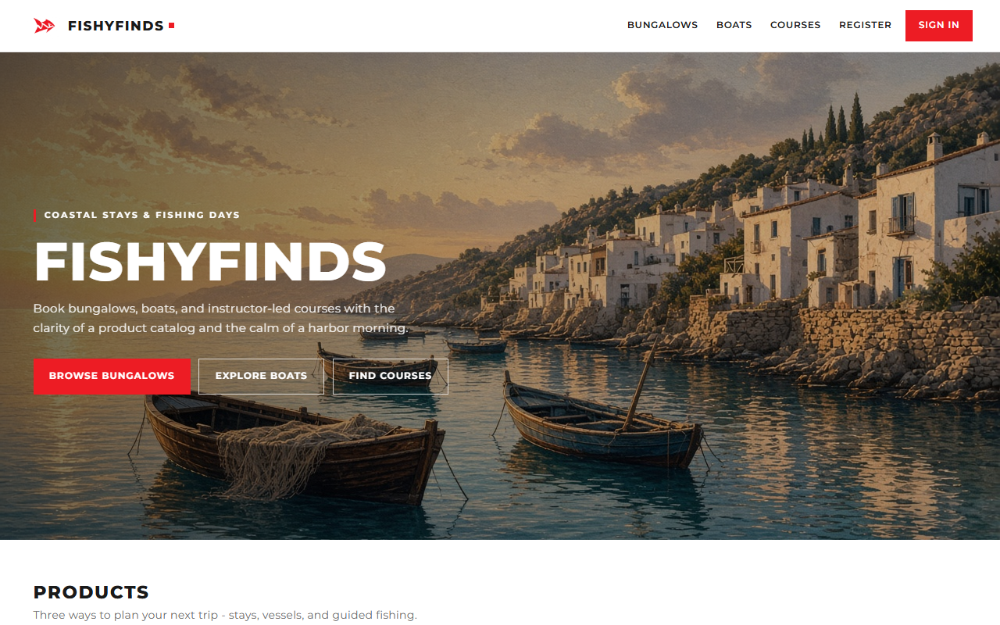

*Figure 4. Guest home — harbor hero, brand **FISHYFINDS**, CTAs for bungalows / boats / courses, REGISTER and SIGN IN in the chrome.*

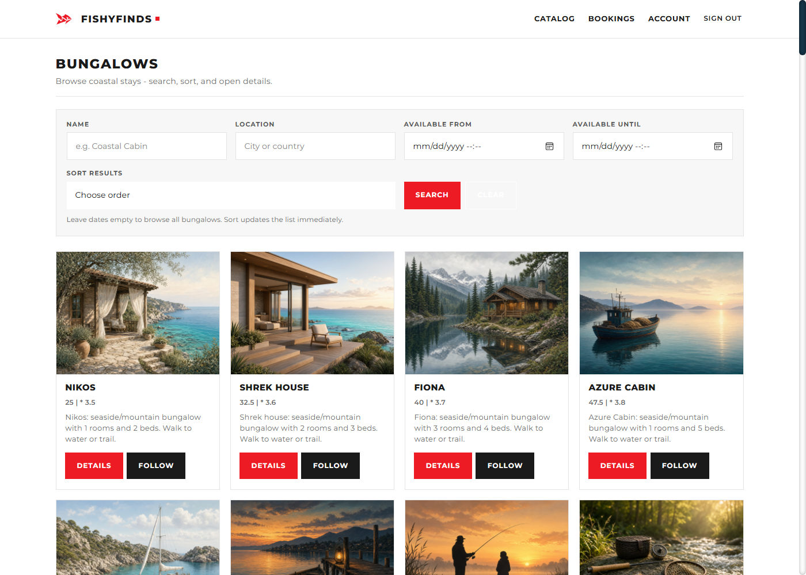

*Figure 5. Public bungalow catalog — card grid with photo, price, rating, location; entry point for guest browsing and customer search.*

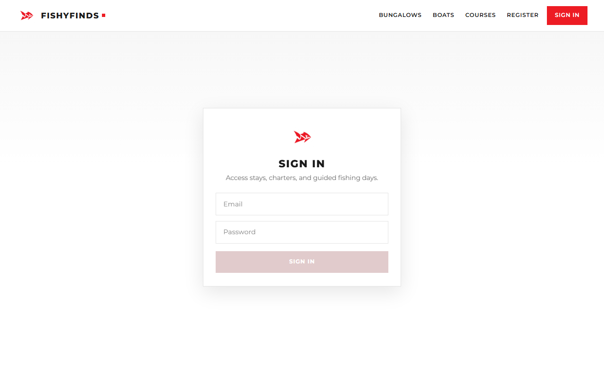

*Figure 6. Sign-in — JWT login against `/api` authentication; demo accounts use password `password`.*

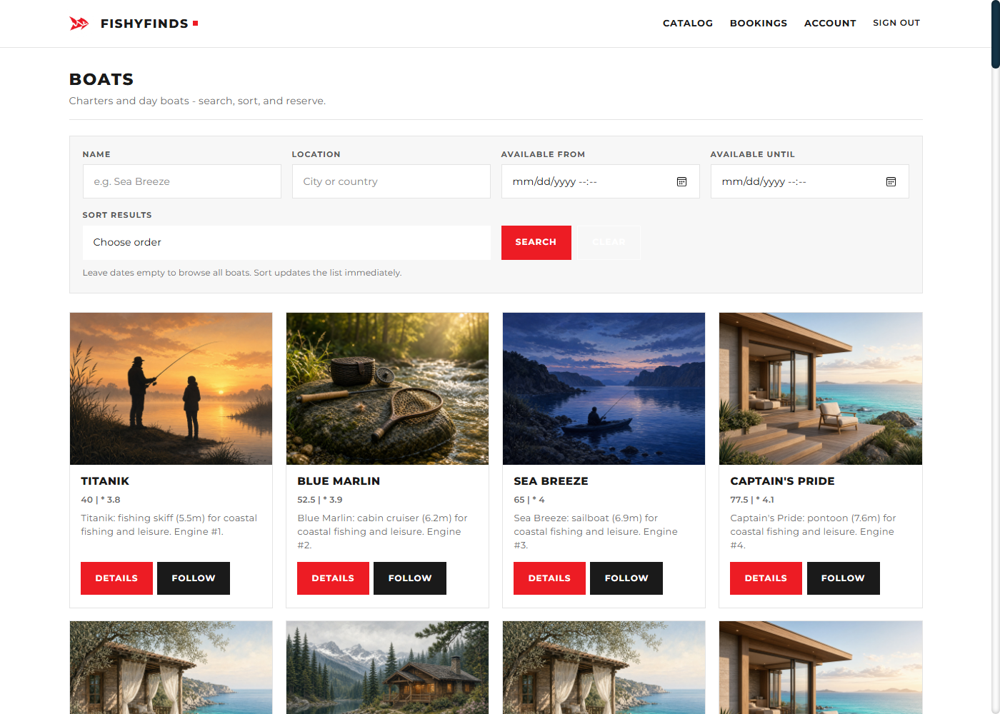

*Figure 7. Boats catalog — same product-card pattern as bungalows; owner role later manages these via My boats.*

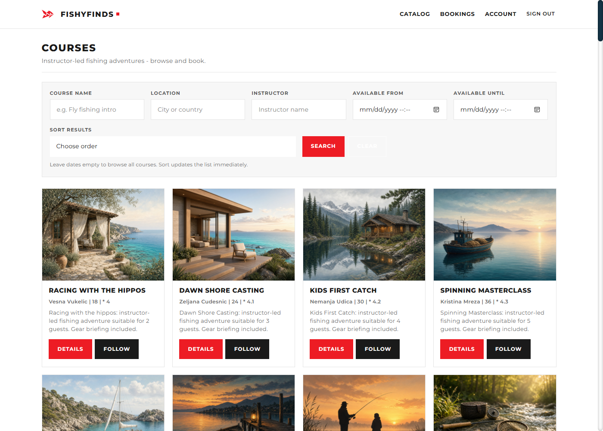

*Figure 8. Courses catalog — instructor-led fishing courses exposed to guests and customers.*

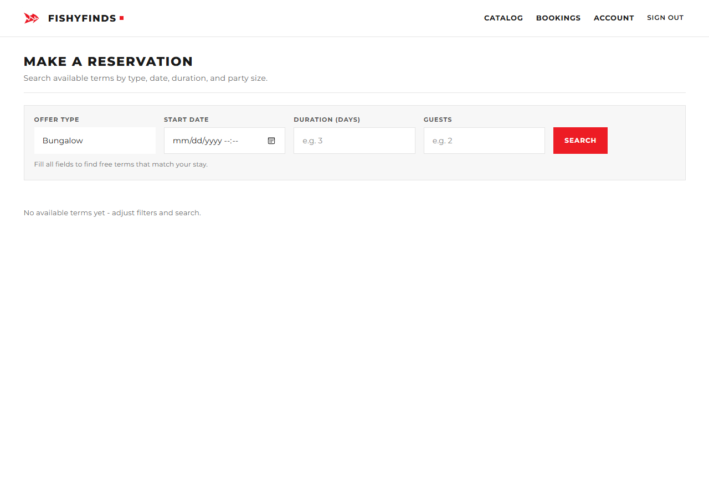

*Figure 9. Reservation flow UI — customer selects a free term on an offer and confirms booking (service enforces availability and unavailability rules).*

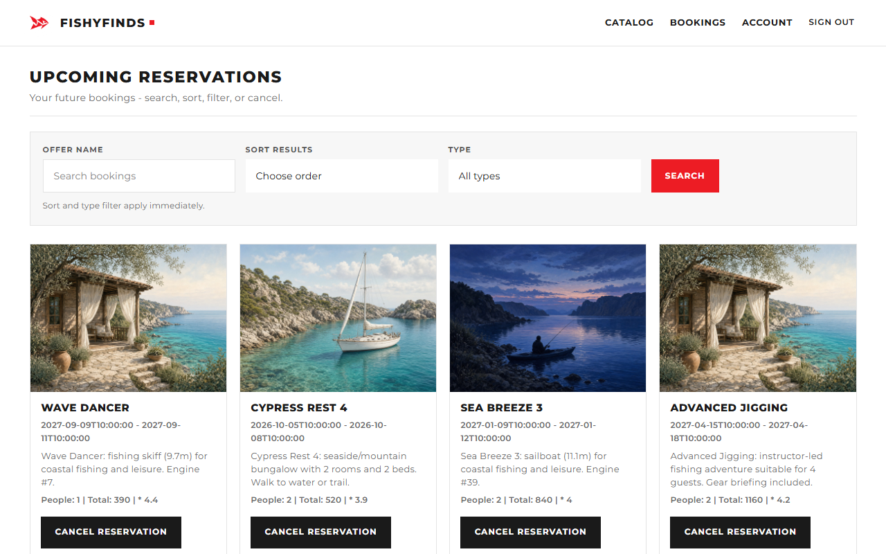

*Figure 10. Customer upcoming reservations — cancel is offered only when the ≥3-day rule still holds.*

### 10.2 Owners and instructor

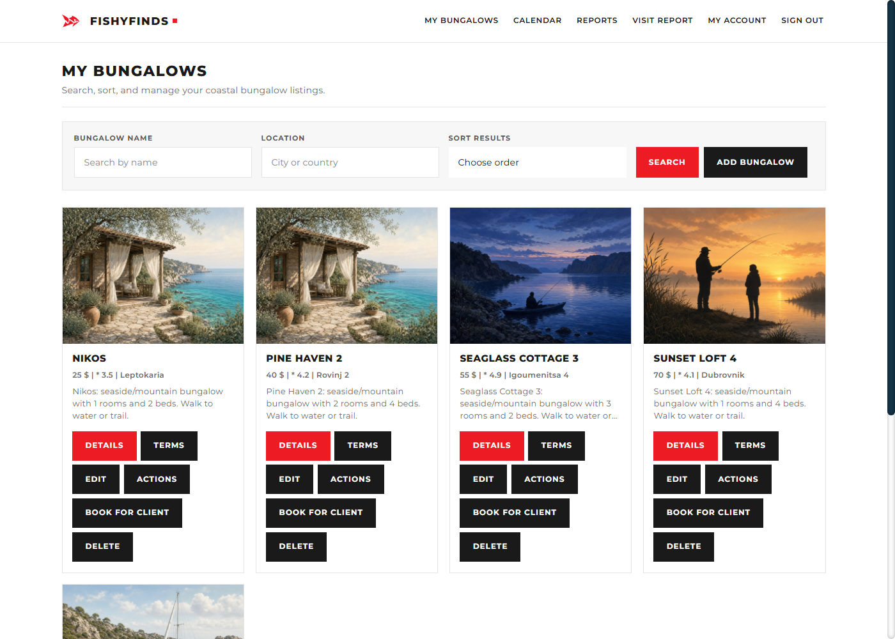

*Figure 11. My bungalows (Laslo / bungalow owner) — search/sort, ADD BUNGALOW, and per-card Details / Terms / Edit / Actions / Book for client / Delete.*

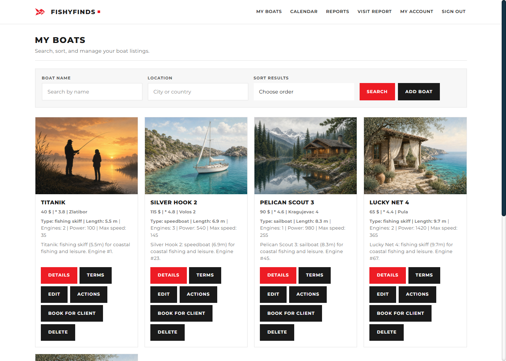

*Figure 12. My boats — boat-owner parity with the bungalow management surface.*

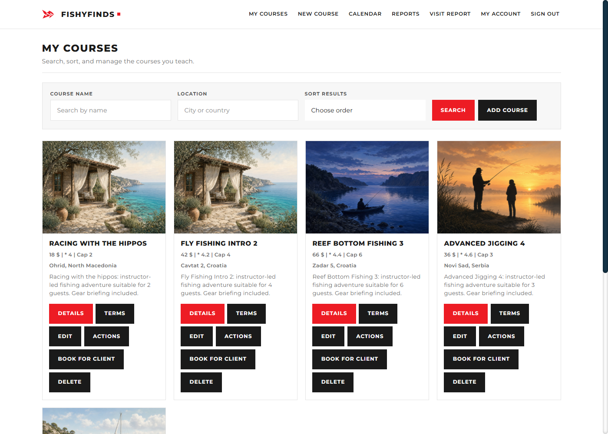

*Figure 13. My courses (instructor) — course CRUD and the same term/action/book tools as other advertisers.*

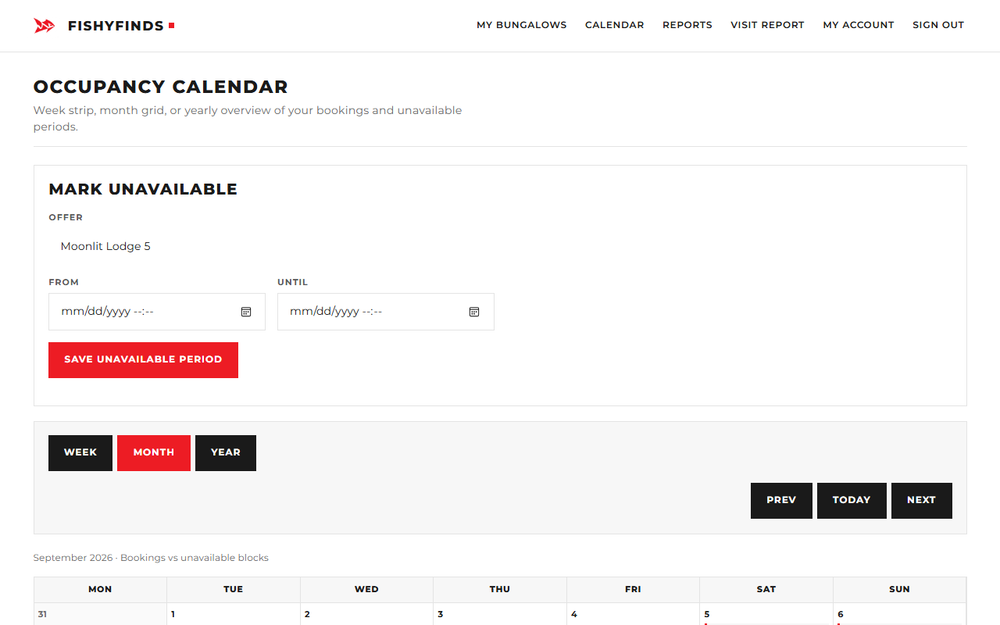

*Figure 14. Owner calendar — occupancy plus `OfferUnavailability` blocks so closed ranges cannot be booked.*

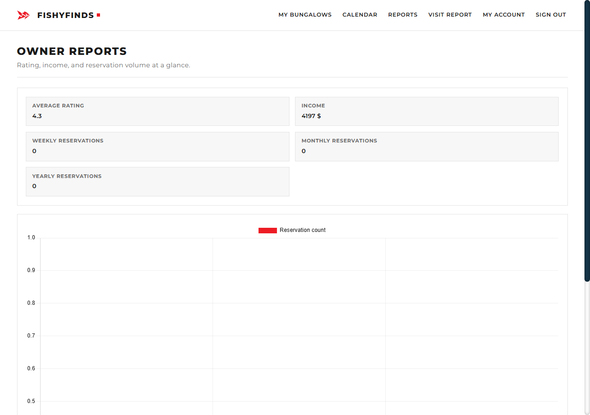

*Figure 15. Owner reports — Chart.js business charts (occupancy / income style analytics for the advertiser).*

### 10.3 Admin

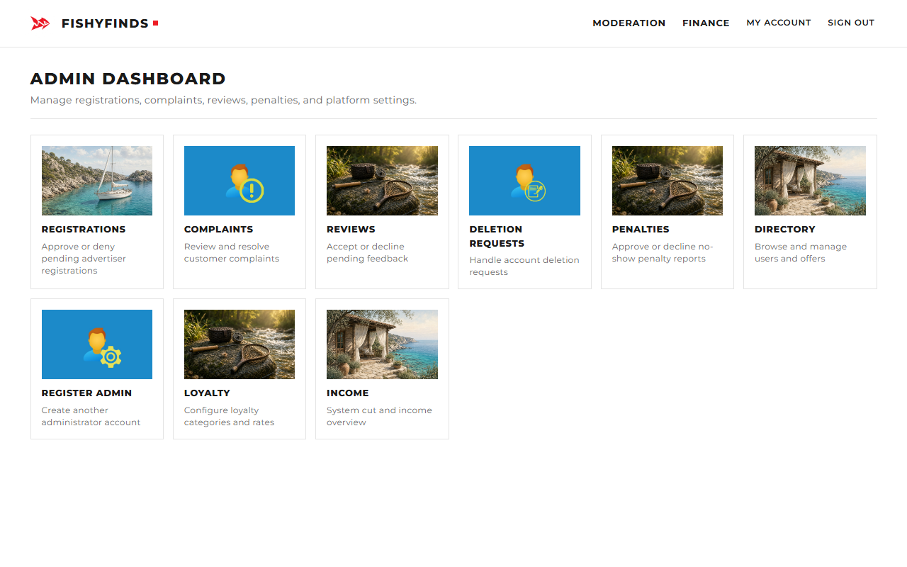

*Figure 16. Admin dashboard — tile hub for registrations, complaints, reviews, deletions, penalties, directory, register-admin, loyalty, income.*

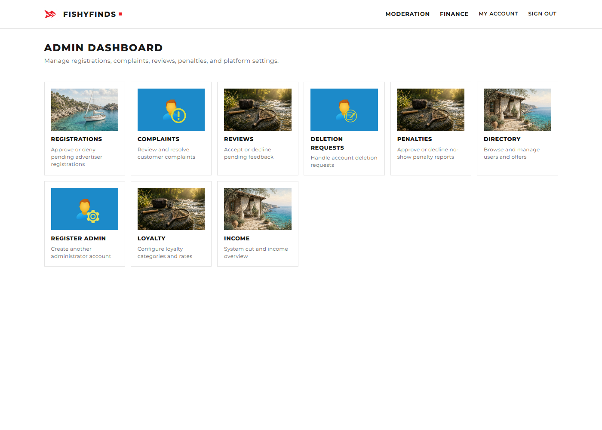

*Figure 17. Registrations queue — approve or deny pending advertiser registrations.*


*Figure 18. Complaints queue — resolve customer complaints with admin decision mail when SMTP is available.*

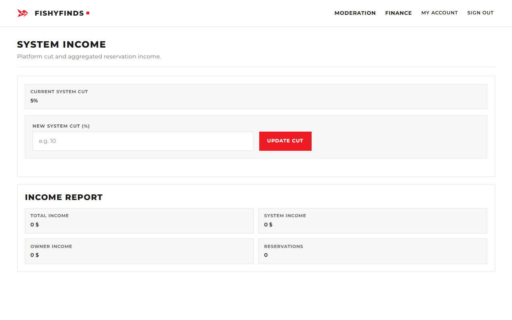

*Figure 19. Income / system cut — platform finance overview for the administrator.*

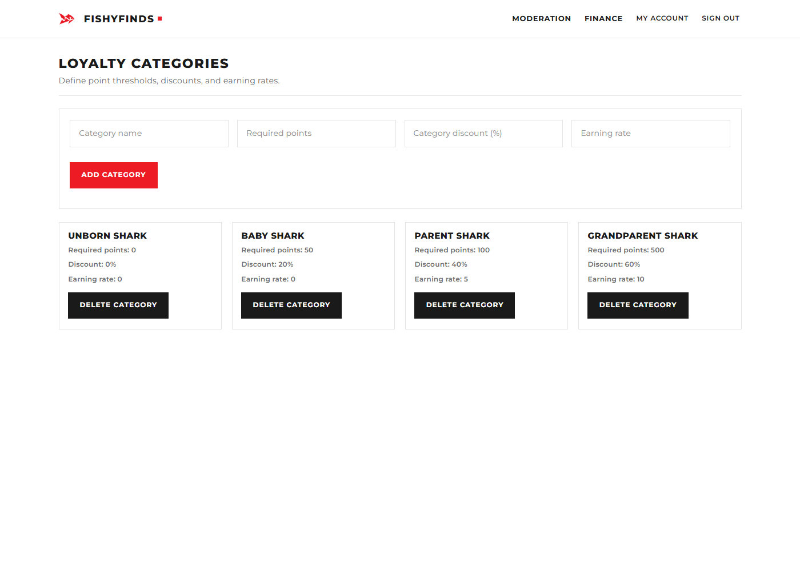

*Figure 20. Loyalty program — configure categories and point rates (grade 7 epic owned with the instructor/admin student).*

## 11. Security, mail, and data

- Passwords stored with Spring Security hashing; API authorization is JWT + role checks.
- Registration for advertisers stays `PENDING` until admin approval.
- Mail is **best-effort**: booking and quick-action success paths do not depend on a working SMTP server (important for offline demos).
- Schema strategy for demos: Hibernate `create-drop` reloads `data-postgres.sql` each boot. Term dates in seed use **2027** windows. Sequence `setval` calls keep `loyalty_program` / `penal` inserts from colliding with identity columns.

## 12. Concurrency, tests, and scalability

**Concurrency (grade 8).** Optimistic `@Version` on `Term` and `Reservation`; pessimistic locking on customer lookup where double-booking races matter. Narrative + diagrams: `docs/concurrent-access/` (Student 1 client, Student 2 owners, Student 3 admin/instructor).

**Tests (grade 9).** Service-level Mockito coverage for reservation create/cancel, quick action, loyalty CRUD, and penal approval. `./mvnw test` on JDK 17 is green. Live regression: `scripts/full-smoke.ps1` (66 checks).

**Scalability (grade 10).** Written PoC discusses partitioning, read replicas, load balancing, and caching. In code, catalog `findAll` endpoints are `@Cacheable` so repeated guest traffic does not always hit PostgreSQL.

## 13. Build and run (2026 check)

```text
# PostgreSQL: database fishyfinds_db (defaults user/password root/root;
# override with DB_USERNAME / DB_PASSWORD — do not commit secrets)

./mvnw spring-boot:run
# open http://localhost:8080

./mvnw test
powershell -File scripts/full-smoke.ps1
powershell -File scripts/capture-screenshots.ps1
```

JDK **17+** recommended even though `pom.xml` declares Java 11. App serves SPA and API on port **8080**.

## 14. Summary

FishyFinds is the ISA 2021/22 team archive: a Spring Boot + Vue 2 + PostgreSQL marketplace for bungalows, boats, and fishing courses, with a clear three-student role split, JWT security, admin moderation, maps/charts/calendar/loyalty, concurrent-access documentation, automated tests/CI, and a caching-backed scalability note. Verified locally on 9 September 2026 with **66/66** smoke checks and green Maven tests. This dossier pairs English and Serbian Latin editions for the oral defense and for later rebuilds of the archive.

## 15. Related documents

| Document | Path |
|---|---|
| Serbian dossier | [DOSSIER_SR.md](DOSSIER_SR.md) |
| Interactive HTML | [dossier.html](dossier.html) |
| Concurrent access | `../concurrent-access/` |
| Scalability PoC | `../scalability/SCALABILITY_POC.md` |
| Screenshots | `../screenshots/` |
| Diagrams | `../assets/diagrams/` |

*FishyFinds ISA technical dossier — English edition.*
